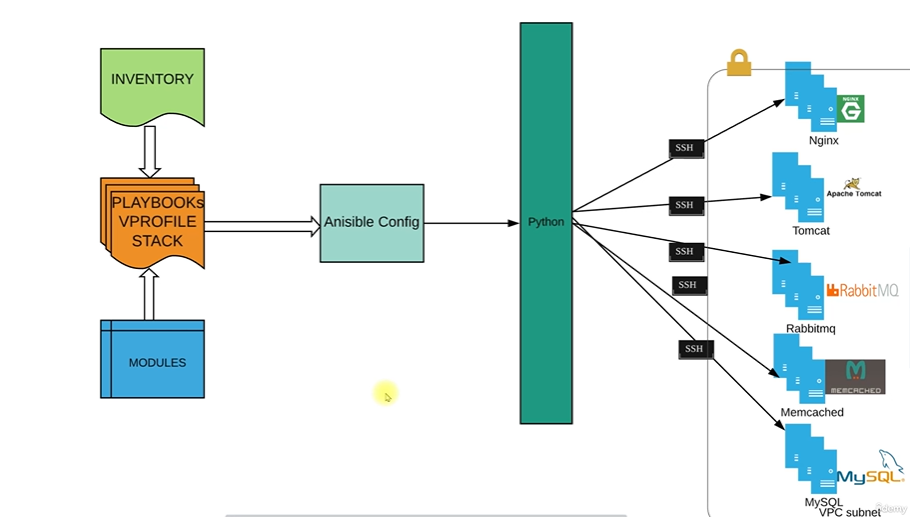

# Project-9:Complete Provisioning With Ansible

## Pre-Requisites:

* AWS Account
* IDE (IntelliJ, VSCode, etc)
* GitHub account, git
* Project-8 :Ansible for AWS VPC



### Step-1: Variable update
So we have to create a new branch on our private repository where we store our playbook from project 8 and name this as V-profile.Move the files from bastion_setup to vpc setup_and delete bastion_setup.

### Step-2: Create a site.yml file

We will create a new file site.yml 

```sh
---
- import_playbook: vpc-setup.yml
- import_playbook: Bastion-instance.yml
```
commit changes.

### Step-3: create Vars,AMI & Key Pairs for stack

we add a new file for our playbook 
"vpro-ec2-stack.yml"

```sh
---
- name: Setup Vprofile Stack
  hosts: localhost
  connection: local
  gather_facts: no
  tasks:
    - name: Import VPC setup Variable
      include_vars: vars/vpc-output_vars

    - name: Import vprofile setup Variable
      include_vars: vars/vprostacksetup

    - name: Create vprofile ec2 key
      ec2_key:
        name: vprokey
        region: "{{region}}"
      register: vprokey_out

    - name: Save private key into file loginkey_vpro.pem
      copy:
        content: "{{vprokey_out.key.private_key}}"
        dest: "./loginkey_vpro.pem"
        mode: 0600
      when: vprokey_out.changed

```
### Step-4: create security group for stack

```sh
 - name: Create Securiry Group for Load Balancer
      ec2_group:
        name: vproELB-sg
        description: Allow port 80 from everywhere and all port within sg
        region: "{{region}}"
        vpc_id: "{{vpcid}}"
        rules:
          - proto: tcp
            from_port: 80
            to_port: 80
            cidr_ip: 0.0.0.0/0
      register: vproELBSG_out

    - name: Create Securiry Group for Vprofile Stack
      ec2_group:
        name: vproStack-sg
        description: Allow port 22 from everywhere and all port within sg
        region: "{{region}}"
        vpc_id: "{{vpcid}}"
        purge_rules: no
        rules:
          - proto: tcp
            from_port: 80
            to_port: 80
            group_id: "{{vproELBSG_out.group_id}}"

          - proto: tcp
            from_port: 22
            to_port: 22
            group_id: "{{BastionSGid}}"
      register: vproStackSG_out

    - name: Update Securiry Group with its own sg id
      ec2_group:
        name: vproStack-sg
        description: Allow port 22 from everywhere and all port within sg
        region: "{{region}}"
        vpc_id: "{{vpcid}}"
        purge_rules: no
        rules:
          - proto: all
            group_id: "{{vproStackSG_out.group_id}}"

```

add this file to bastion-instance so we can get the security group ID
```sh
- name: Insert/Update "BastionSGid" in vars/vpc-output_vars
      blockinfile:
        path: vars/vpc-output_vars
        backup: yes
        block: |
          BastionSGid: {{BastionSG_out.group_id}}

```
install ansible 2.10 before running the playbook again
export PATH=$PATH:/usr/local/bin

### Step-4: create ec2 instances for stack
```sh
- name: Creating Nginx web01
      ec2:
        key_name: vprokey
        region: "{{region}}"
        instance_type: t2.micro
        image: "{{nginx_ami}}"
        wait: yes
        wait_timeout: 300
        instance_tags:
          Name: "web01"
          Project: Vprofile
          Owner: DevOps Team
        exact_count: 1
        count_tag:
          Name: "web01"
          Project: Vprofile
          Owner: DevOps Team
        group_id: "{{vproStackSG_out.group_id}}"
        vpc_subnet_id: "{{privsub1id}}"
      register: web01_out

    - name: Creating tomcat app01
      ec2:
        key_name: vprokey
        region: "{{region}}"
        instance_type: t2.micro
        image: "{{tomcat_ami}}"
        wait: yes
        wait_timeout: 300
        instance_tags:
          Name: "app01"
          Project: Vprofile
          Owner: DevOps Team
        exact_count: 1
        count_tag:
          Name: "app01"
          Project: Vprofile
          Owner: DevOps Team
        group_id: "{{vproStackSG_out.group_id}}"
        vpc_subnet_id: "{{privsub1id}}"
      register: app01_out

    - name: Creating memcache mc01
      ec2:
        key_name: vprokey
        region: "{{region}}"
        instance_type: t2.micro
        image: "{{memcache_ami}}"
        wait: yes
        wait_timeout: 300
        instance_tags:
          Name: "mc01"
          Project: Vprofile
          Owner: DevOps Team
        exact_count: 1
        count_tag:
          Name: "mc01"
          Project: Vprofile
          Owner: DevOps Team
        group_id: "{{vproStackSG_out.group_id}}"
        vpc_subnet_id: "{{privsub1id}}"
      register: mc01_out

    - name: Creating RabbitMQ rmq01
      ec2:
        key_name: vprokey
        region: "{{region}}"
        instance_type: t2.micro
        image: "{{rmq_ami}}"
        wait: yes
        wait_timeout: 300
        instance_tags:
          Name: "rmq01"
          Project: Vprofile
          Owner: DevOps Team
        exact_count: 1
        count_tag:
          Name: "rmq01"
          Project: Vprofile
          Owner: DevOps Team
        group_id: "{{vproStackSG_out.group_id}}"
        vpc_subnet_id: "{{privsub1id}}"
      register: rmq01_out

    - name: Creating Mysql db01
      ec2:
        key_name: vprokey
        region: "{{region}}"
        instance_type: t2.micro
        image: "{{mysql_ami}}"
        wait: yes
        wait_timeout: 300
        instance_tags:
          Name: "db01"
          Project: Vprofile
          Owner: DevOps Team
        exact_count: 1
        count_tag:
          Name: "db01"
          Project: Vprofile
          Owner: DevOps Team
        group_id: "{{vproStackSG_out.group_id}}"
        vpc_subnet_id: "{{privsub1id}}"
      register: db01_out

    - debug:
        var: db01_out.tagged_instances[0].id
```
### Step-5: create a private or public repository to save our playbook for Vstack

SEE 
https://github.com/eregbene/ansible-aws-vpc/tree/vprofile-stack

for my stack

