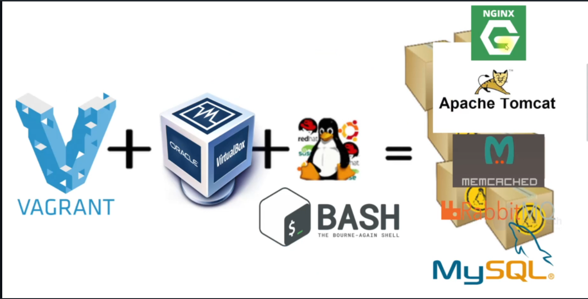

# Multi-Tier Web Application(servers) setup Locally (using Virtual Box and Vargrant for Automation)

 In this project I will be showing you how to start a Multi-Tier Web Application that communicate with each other,on your local machine using virtual box and vargrant to atomate the process.

 I will be deploying a Nginx,tomcat"MySQL/MariaDB Memcached, RabbitMQ servers using vagrant.

  I used Maven to build the .war artifact sourcecode https://github.com/devopshydclub/vprofile-project which will be deployed to the Tomcat server Many thanks to @imranteli for his awesome lectures - i will not fail you shifu. 

## Prerequisite
1. Oracle VM Virtualbox
2. Vagrant
3. Vagrant plugins
    * vagrant plugin install vagrant-hostmanager (to ping other servers(applications) on our loacal machine) ** if you have anyerror message    makesure you have the latest Vagrant install on your machine you can also reinstall vagrant
    * vagrant plugin install vagrant-vbguest
4. Git bash or equivalent editor

