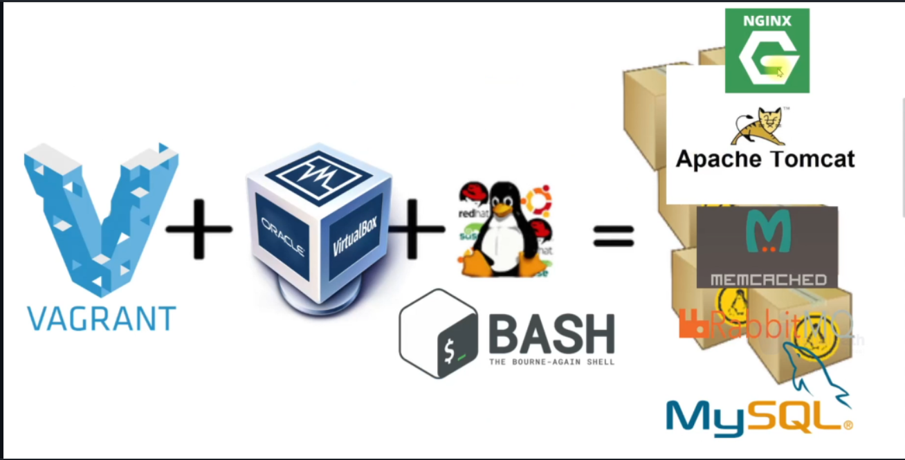

# Multi-Tier Web Application(servers) setup Locally (using Virtual Box and Vargrant for Automation)

 In this project I will be showing you how to start a Multi-Tier Web Application that communicate with each other,on your local machine using virtual box and vargrant to atomate the process.

 I will be deploying a Nginx,tomcat MySQL/MariaDB Memcached, RabbitMQ servers using vagrant.

  ### I used Maven to build the .war artifact sourcecode https://github.com/devopshydclub/vprofile-project which will be deployed to the Tomcat server Many thanks to @imranteli for his awesome lectures - i will not fail you shifu. 

## Prerequisite
1. Oracle VM Virtualbox
2. Vagrant
3. Vagrant plugins
    * vagrant plugin install vagrant-hostmanager (to ping other servers(applications) on our loacal machine) ** if you have anyerror message    makesure you have the latest Vagrant install on your machine you can also reinstall vagrant
    * vagrant plugin install vagrant-vbguest
4. Git bash or equivalent editor

### Below are the list of services i will be preapring each bash scripts;this scripts are in the folder [scripts](../Project-1/scripts)
1. MySQL (MariaDB): SQL Database
2. Memcache: DB caching
3. RabbitMQ: Broker/Queuing Agent
4. Tomcat: Application server
5. Nginx: Web service

### Preparing the Bash Scripts for each Virtual machine
* Bash script for `MySQL` in `mysql.sh` file for our database server
    * [mysql.sh](../Project-1/scripts/mysql.sh)
* Bash script for `Memcache` in `memcache.sh` file for our memcache server 
     * [memcache.sh](../Project-1/scripts/memcache.sh)
* Bash script for `RabbitMQ` in `rabbitmq.sh` file for RabbitMQ server
    *  [rabbitmq.sh](../Project-1/scripts/rabbitmq.sh)
* Bash Script for `Application` in `tomcat.sh` file for the tomcat server
    * [tomcat.sh](../Project-1/scripts/tomcat.sh)
* Lastly, create a bash script to provision `Nginx server` which will forward requests to our backend application in `nginx.sh`
    * [nginx.sh](../Project-1/scripts/nginx.sh)

 ### Bring up the Virtual Mchines
* clone this repository 
```sh
        git clone https://github.com/eregbene/DevOps-cloudprojects.git
```

* Go to directory that our Vagrantfile [Vagrantfile](../Project-1/scripts/vagrantfile) exists and install the plugin before briging up the virtual machines(to ping each other).
```sh
    cd DevOps-cloudprojects/Project-1/scripts
    vagrant plugin install vagrant-hostmanager
```

* After plugin installed, we can run below command to setup our VMs which will also bootstrap our servers for us.
```sh
    vagrant up
```
### Validate
* Validae the VM are up are running from your vitual machine.